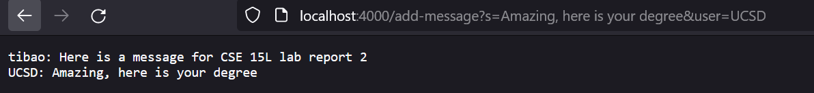
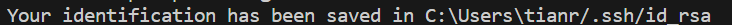

# Servers and SSH Keys
## Part 1
### ```ChatServer``` code screenshot


### ```/add-message``` example 1


The method called in this webserver URL is ```handleRequest```.  
The relevant argument to ```handleRequest``` is the query ```/add-message?s=Here is a message for CSE15L lab report 2&user=tibao```. The ```/add-message``` part signals to the code that a message should be added onto the chatlog, the ```?``` indicates the start of the query, and the ```s=...``` indicates the message body (in this case ```Here is a message for CSE15L lab report 2```) and ```user=...``` indicates the user that sent the message (in this case ```tibao```). These two paramaters are taken together and processed such that it is recorded to the chatlog in the desired format of ```user: s```.   
The field of the class that changes in this case is the ```chatLog``` variable, which is updated to include the new message that is passed through to the webserver. 


### ```/add-message``` example 2


The method called in this URL is also ```handleRequest```.  
The relevant argument to ```handleRequest``` is the query ```/add-message?s=Amazing, here is your degree&user=UCSD```. Like the previous example, the ```/add-message``` part signals to the code that a message should be added onto the chatlog, ```?``` indicates the start of the query, and ```s=...``` indicates the message body (in this case ```Amazing, here is your degree&```) and ```user=...``` indicates the user that sent the message (in this case ```UCSD```). These two paramaters are taken together and processed such that it is recorded to the chatlog in the desired format of ```user: s```.   
The field of the class that changes in this case is the ```chatLog``` variable, which is updated to include the new message that is passed through to the webserver in addition to the already stored message. 

## Part 2
### ```ls``` of SSH file:


### Absolute path to private key:


### Absolute path to public key:


### Passwordless SSH login:


## Part 3
From lab during week 2 and 3, I learned about how to log into a SSH server (both with a password and a ssh key), as well as how to create and copy files within the server. 
Before this class, SSH and remote servers were completely foreign to me, so being able to get more familiar with them in this class was really cool. 
