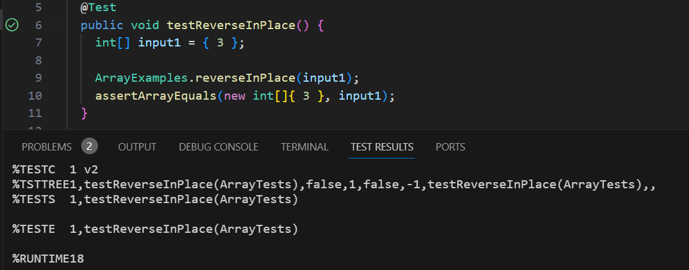
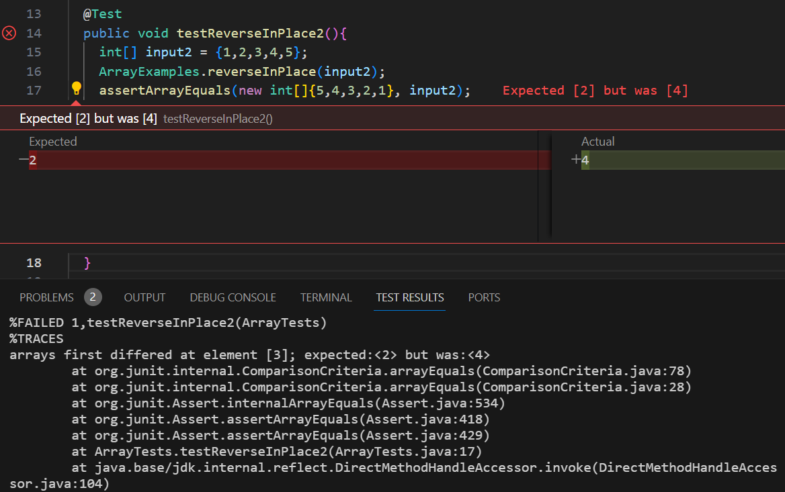

# File Exploration and Text Analysis from the Command Line
## Part 1 - Bugs
### Chosen Bug 
In ```ArrayExamples.java```, there is a method to reverse in place that does not work for arrays greater than size 1.   
Original Code: 
```
static void reverseInPlace(int[] arr) {
  for(int i = 0; i < arr.length; i += 1) {
    arr[i] = arr[arr.length - i - 1];
  }
}
```
### Failure Inducing Input 
The code above fails for all arrays that are greater than size 1.  
The following block of code induces a failure in the code.
```
@Test
public void testReverseInPlace2(){
  int[] input2 = {1,2,3,4,5};
  ArrayExamples.reverseInPlace(input2);
  assertArrayEquals(new int[]{5,4,3,2,1}, input2);
}
```
### Successful Input
The code from the original code works for arrays that are size 1.
The following block of code doesn't induce a failure in the code.
```
@Test 
public void testReverseInPlace() {
  int[] input1 = { 3 };
  
  ArrayExamples.reverseInPlace(input1);
  assertArrayEquals(new int[]{ 3 }, input1);
}
```
### Symptoms
Successful Input:  

Unsuccessful Input:   

### Fixing the Bug
Before Fix:
```
static void reverseInPlace(int[] arr) {
  for(int i = 0; i < arr.length; i += 1) {
    arr[i] = arr[arr.length - i - 1];
  }
}
```
After Fix: 
```
static void reverseInPlace(int[] arr) {
  for(int i = 0; i < arr.length/2; i += 1) {
    int temp = arr[i];
    arr[i] = arr[arr.length - i - 1]; 
    arr[arr.length - i - 1] = temp;
  }
}
```

The bug from before would cause the entire array to be overwritten by the second to last element. This fix works because it implements a temporary variable to store the value and essentially works its way inward from the ends of the array and swaps values from the sides until it reaches the center of the array.
## Part 2 - Researching Commands - ```grep```
(All examples and explanations are based off of the Linux manual page found at https://www.man7.org/linux/man-pages/man1/grep.1.html). 
The command I chose to explore further was ```grep```. 
### ```grep -v```
The ```-v``` option causes ```grep``` to return the lines that do not match the given query.   
Example 1:   
```
tianr@BAO-LAPTOP MINGW64 ~/UCSDgithub/CSE15L/docsearch (main)
$ grep -v "," technical/biomed/1468-6708-3-1.txt


        Introduction
        even though there is little evidence that overweight is
        associated with increased mortality in those over age 65.
        Six large controlled population-based studies of
        non-smoking older adults have investigated the association
        for relevant covariates [ 1 2 3 4 5 6 ] . All studies found
        with moderately high BMI had little or no extra risk except
```
In example 1, ```grep``` searches for lines in ```technical/biomed/1468-6708-3-1.txt``` that do not contain commas, and this results in some lines of the text file, such as "Older adults are frequently counseled to lose weight," and "excess risk for persons with very low BMI, but that persons" to not be included in the output.  
Example 2:   
```
tianr@BAO-LAPTOP MINGW64 ~/UCSDgithub/CSE15L/docsearch (main)
$ grep -v "to" technical/plos/journal.pbio.0020001.txt 


        challenges of building bridges across these gaps that should bring the United Nations and
        importance of reducing the inequalities in science between developed and developing
        countries, asserting that “This unbalanced distribution of scientific activity generates
        serious problems not only for the scientific community in the developing countries, but for
        development itself.” Indeed, Mr. Annan's sentiments have also been echoed recently by
```
In example 2, ```grep``` searches for lines in ```technical/plos/journal.pbio.0020001.txt ``` that do not contain the word "to", and this results in the first two lines of text ("Kofi Annan, the Secretary-General of the United Nations, recently called attention to
        the clear inequalities in science between developing and developed countries and to the") and the fourth line of text ("the world scientific community closer to each other (Annan 2003). Mr. Annan stressed the") being removed.

### ```grep -i```
The ```-i``` option causes ```grep``` to ignore case in its search through a text file.    
Example 1:  
```
tianr@BAO-LAPTOP MINGW64 ~/UCSDgithub/CSE15L/docsearch (main)
$ grep -i "z" technical/biomed/1468-6708-3-1.txt
        well characterized. The goal is to determine whether
          the effect size for each measure, comparing each BMI
          subgroup to the 'normal' group. The effect size is the
          their common standard deviation. Since the sample size
          proportional to the inverse of the squared effect size,
          large effect sizes are desirable.
        increase sample size for those with low BMI, we combined
        the normal group, in part because of low sample size. Men
        We next present the effect size for comparing each group
        to the normal BMI group. The effect sizes are shown in
        standard deviation was 1.44. The effect size is thus
        different YHL, implying that the effect size is also
```
In example 1, ```grep``` searches for lines in ```technical/biomed/1468-6708-3-1.txt``` where instances of "y" - both capitalized or uncapitalized - appear. It then returns the lines that have a "y" in it while omitting the rest of the lines.   
Example 2:   
```
tianr@BAO-LAPTOP MINGW64 ~/UCSDgithub/CSE15L/docsearch (main)
$ grep -i "united nations" technical/plos/journal.pbio.0020001.txt
        Kofi Annan, the Secretary-General of the United Nations, recently called attention to
        challenges of building bridges across these gaps that should bring the United Nations and
        Goldemberg 1998; Riddoch 2000). For example, recent United Nations Educational, Scientific,
```
In example 2, ```grep``` searches for lines in ```technical/plos/journal.pbio.0020001.txt ``` where the phrase "united nations" appears. Since ```-i``` was used, proper capitalization is not required for finding the phrase, and makes searching a bit easier.

### ```grep -c```
The ```-c``` option causes ```grep``` to print a count of matching lines instead of a list of matching lines.     
Example 1:  
```
tianr@BAO-LAPTOP MINGW64 ~/UCSDgithub/CSE15L/docsearch (main)
$ grep -c "z" technical/biomed/1468-6708-3-1.txt
23
```
In example 1, ```grep``` counts the number of lines in ```technical/biomed/1468-6708-3-1.txt``` where the letter "z" was used. Since ```-c``` was used, the number of lines that match instead of the actual lines themselves is returned. Not a lot of lines actually use z in this article!  
Example 2:  
```
tianr@BAO-LAPTOP MINGW64 ~/UCSDgithub/CSE15L/docsearch (main)
$ grep -c "United Nations" technical/plos/journal.pbio.0020001.txt
3
```
In example 2, ```grep``` counts the number of lines in ```technical/plos/journal.pbio.0020001.txt ``` where "United Nations" appears. Since ```-c``` was used, the number of lines that match instead of the actual lines themselves is returned.

### ```grep -w```
The ```-w``` option causes ```grep``` to search the file for lines that contain whole word matches.    
Example 1:  
```
tianr@BAO-LAPTOP MINGW64 ~/UCSDgithub/CSE15L/docsearch (main)
$ grep -w "no" technical/biomed/1468-6708-3-1.txt
        with moderately high BMI had little or no extra risk except
        the difference in BMI was no longer statistically
        in weight loss since age 50 was no longer significant.
        about 6.5 out of 7 years, and showed no evident association
        probably be fruitless since there is no evidence that being
        shown in Table 1were no longer statistically significant,
          overweight (as opposed to the obese) are no different
          appropriate here, since virtually no persons were lost to
        no excess risk for older adults who would be classified as
```
In example 1, ```grep``` counts the number of lines in ```technical/biomed/1468-6708-3-1.txt``` where the whole word "no" appears on its own. Omitting ```-w``` would result in words like "normally" and "nothing" to be included in the result.  
Example 2:  
```
tianr@BAO-LAPTOP MINGW64 ~/UCSDgithub/CSE15L/docsearch (main)
$ grep -w "in" technical/biomed/1468-6708-3-1.txt
        associated with increased mortality in those over age 65.
        in certain small subsets. A review of 13 studies of older
        quality of life or years of healthy life (YHL) in the
        differences in YHL would often require fewer subjects than
        years of being healthy, in a cohort of older adults for
        modification interventions in older adults.
```
In example 2, ```grep``` counts the number of lines in ```technical/plos/journal.pbio.0020001.txt ``` where the word "in" appears on its own. Omitting ```-w``` would result in words like "included" and "inaccessible" to be added in the search result. 
