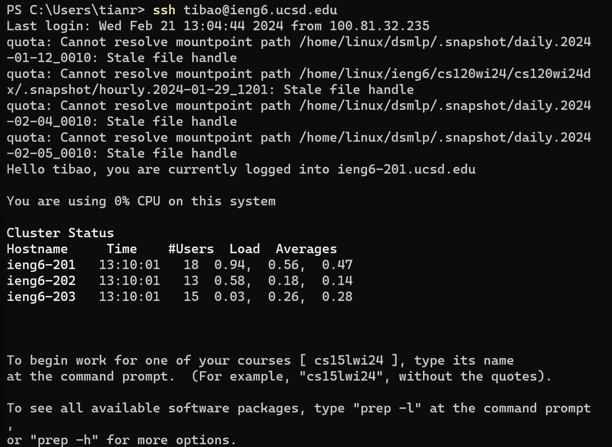
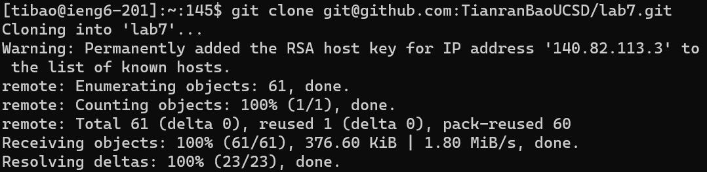
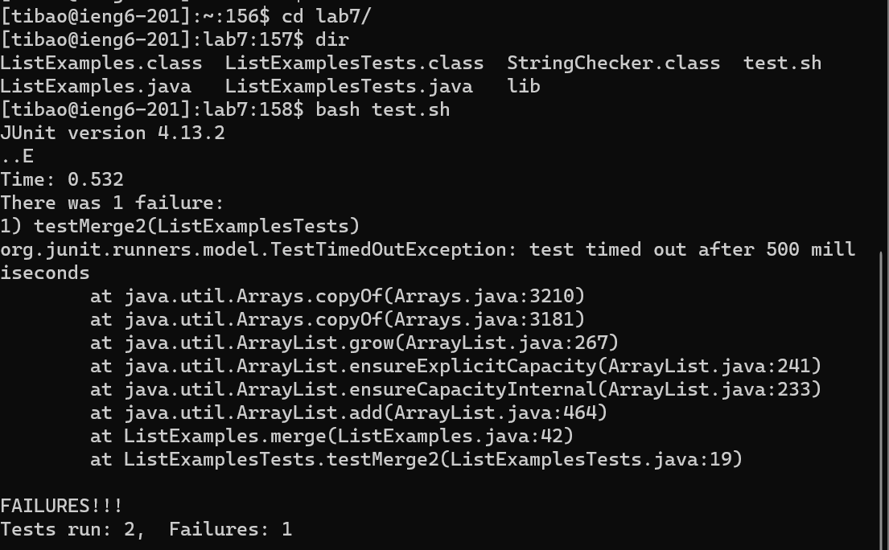

# Vim
## Process For Editing File on ```ieng-6```
### Step 1: ```ssh``` into ```ieng-6```
Keys Pressed: ```ssh tibao<shift>+2ieng6.ucsd.edu<enter>```  
To do this step, I just typed in ```ssh``` and the ```ieng-6``` e-mail address associated with my account. 
There was no need to log in using my password since a SSH key had been set up before, which saves time.



### Step 2: clone forked repository
Keys Pressed: ```git cl<tab> <ctrl>+v<enter>```  
To do this step, I typed in ```git cl``` and pressed tab to autocomplete the ```clone``` command. I then pasted
in the ssh Github link that I had copied over onto my clipboard before using ```<ctrl>+v```.



### Step 3: run tests 
Keys Pressed: ```cd la<tab><enter>```, ```dir<enter>```, ```bash t<tab><enter>```
To do this step, I typed in ```cd la``` and pressed tab to autocomplete getting into the ```lab7``` directory. I then used
the ```dir``` command so I could remind myself what was in the directory, and then finally ran the ```test.sh``` script using ```bash```,
autocompleting the filename by using ```<tab>``` after typing in ```t```.



### Step 4: edit and fix code
Keys Pressed: ```vim L<tab>.java<enter>```, ```44G<enter>```, ```<right arrow><right arrow><right arrow><right arrow><right arrow>r2```, ```<shift>;wq<enter>```
To do this step, I first opened the file with the errors in it in vim by using ```vim ListExamples.java```. I then navigated to the 44th line by using ```44G``` and moved the
cursor over 5 steps to the right, then replaced the 1 in the file with ```r2```. To exit and save, I then used ```:wq```. 


### Step 5: rerun tests
Keys Pressed: ```bash t<tab><enter>```
For this step, I ran the same test shell file as in step 3 by using ```bash test.sh```. 


### Step 6: push to github 
Keys Pressed: ```git add <tab><enter>```, ```git commit -m "fixed errors"```, ```git push```
In this step, I used ```git add``` to stage the changes in the file ```ListExamples.java``` to be pushed to the forked repository. I used tab as a shortcut here to choose the first file in the directory, which happened to be ```ListExamples.java```.
I then committed the changes with a message ```fixed errors``` and ```push```ed the changes to the main file. 


 
