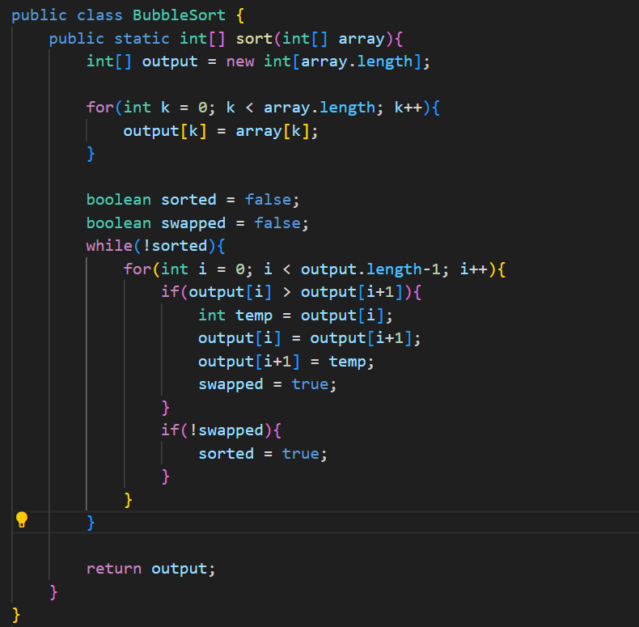
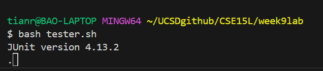
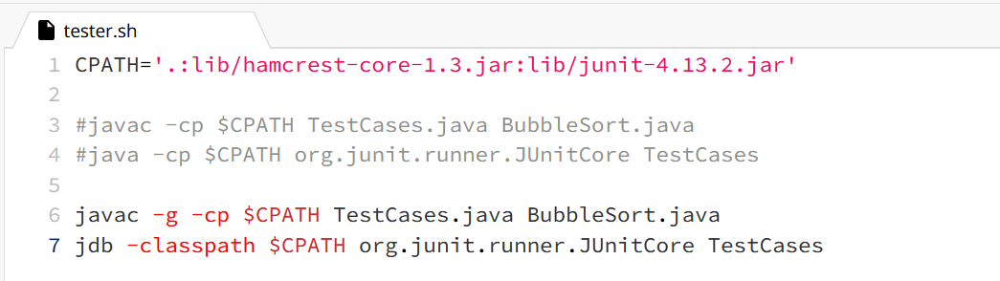
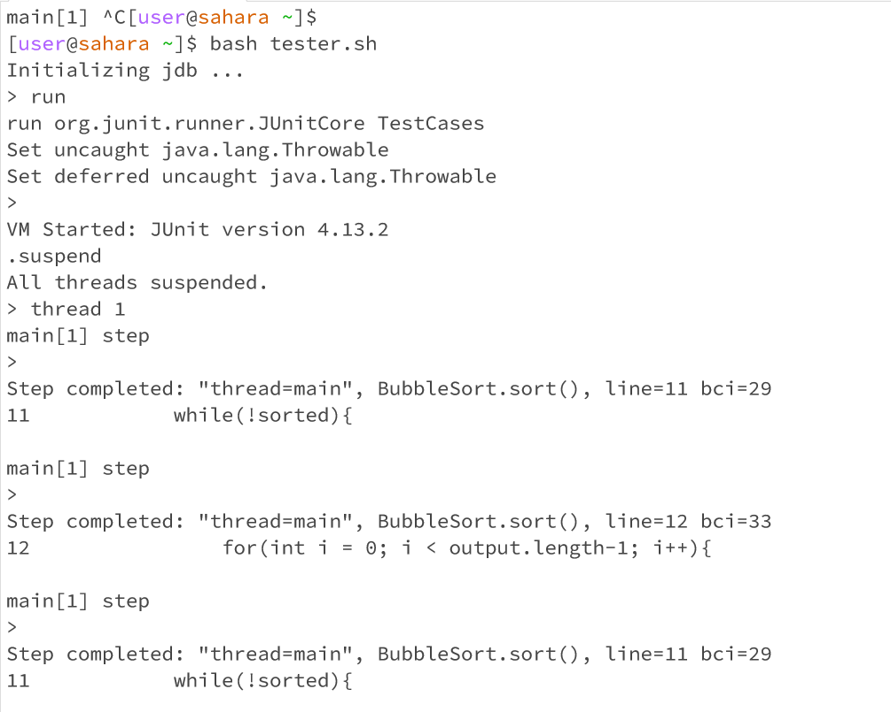
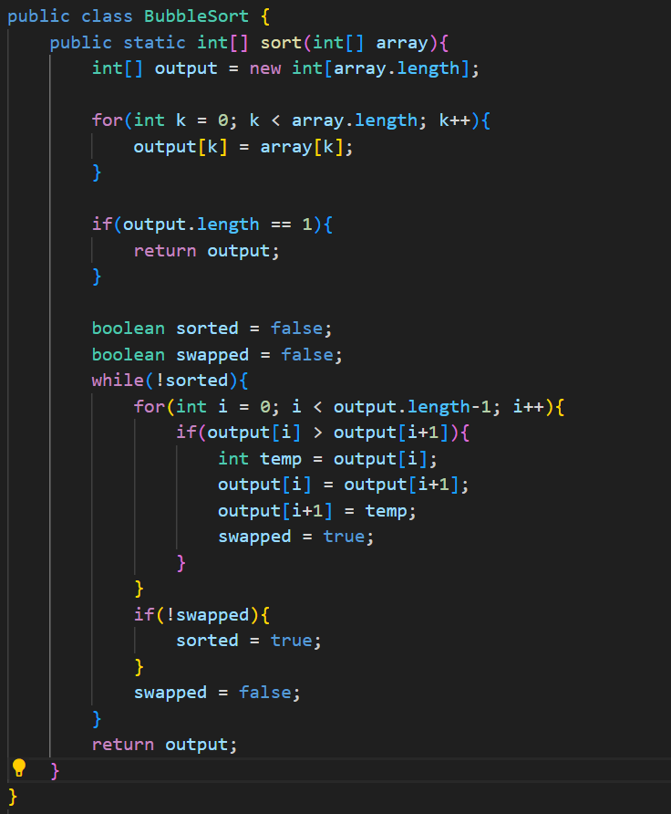
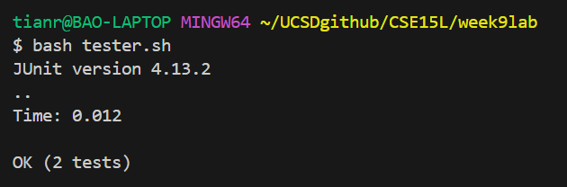

# Debugging Scenario
## Mockup EdStem Post
### Student3942
I've been having an issue with testing my program - I'm trying to run the provided ```tester.sh``` file, but it seems to be running forever. Does anyone know what's going on? 
Here is a screenshot of my code and a screenshot of the terminal output after running ```bash tester.sh```:



### TA101
Hi there Student3942,

It seems like you might be running into an issue with an infinite loop. Try using ```jdb``` and ```suspend``` the process while the infinite loop is happening. Make sure to use ```locals``` to take a look
at what variables are not updating and see if you can figure out the rest from there. Let me know if there is anything else you are confused about!

### Student3942
I had to switch over to EdStem since ```jdb``` wasn't set up on my computer. It turns out that my while loops were getting stuck on lines 11 and 12. 


I rewrote my code to make it a bit more streamlined and not have to deal with the headache of having two loop booleans. This time it works



Thank you for your help! 

# Reflection 
Something interesting that I learned about in the second half of the quarter was finally learning how to use Vim. I've heard so many bad things about using vim and how unintuitive it was, and
this largely proved to be accurate. Despite this, Vim proves to be a very powerful tool that I can use on remote servers to edit code without going through the hassle of downloading it to my
computer and working with version control, so I definitely see the value in it. Being introduced to it in class also helps me get familiarized with the documentation and commands that I need to
continue practicing it on my own and eventually get comfortable with it. 
